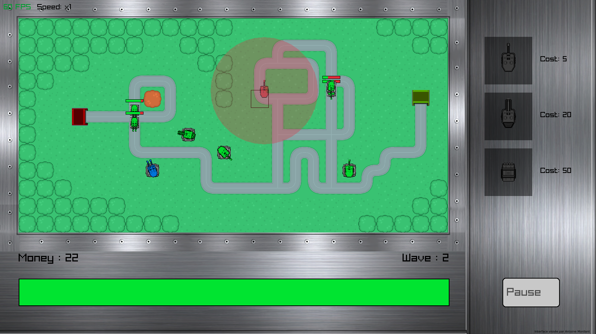
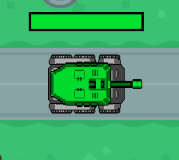
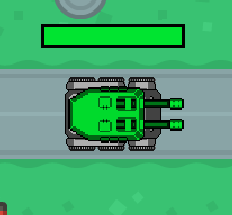
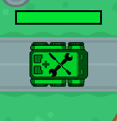
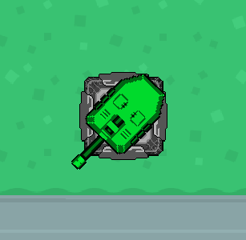
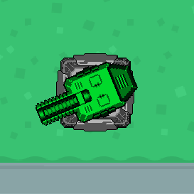
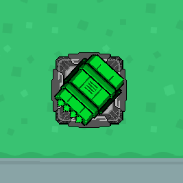
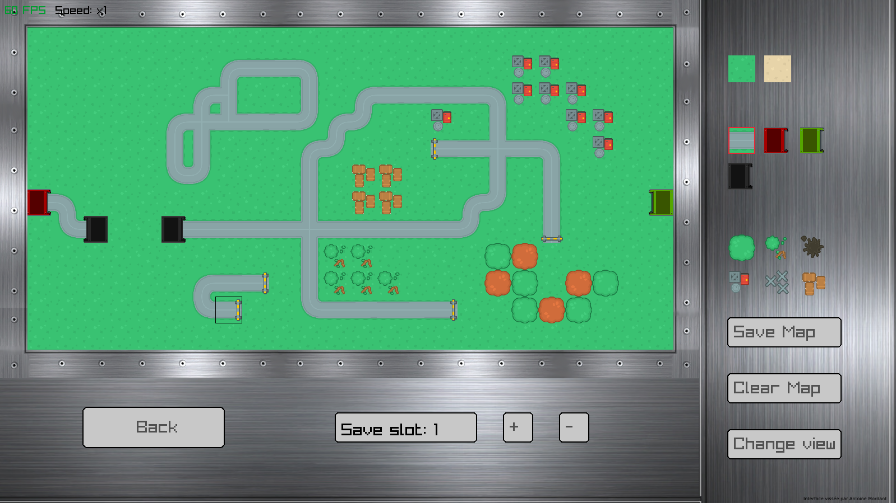

# Projet Tower Defense

This project's goal is to create a *Tower Defense* game in 2D written in C++. 

In this game, you have to defend a base against waves of enemies that follow a road.
To acheive this goal, you have different types of tower which you can place on the map.
These towers will attack the enemies and kill them before they can reach your base.
If the enemies reach your base, it will damage it and if they destroy it, you lose.
Your goal is to survive **25 waves** without having your base destroyed.

This game was made by **Quentin Lepine, Umut Osmanoglu** and **Antoine Mordant** with the help of **raylib** library.

---
# Introduction's cinematic
>*Left-click* to skip it.

---
# Main menu

## Play
Opens the `Menu Play`.

## Options
Opens the `Options` where you can adjust the **sounds** of the game :
- The **main volume**
- The **music volume**
- The **effects volume**

and the **difficulty** :
- **Easy**, for beginners in Tower Defense games, the enemies give lots of money and aren't very resistant.
- **Medium**, original difficulty of the game.
- **Hard**, enemies give less money and are really tanky.
- **Nightmare**, secret difficulty mode unlocked after finishing all the levels.

## Credits
Opens the `Credits` with the names of the creators, the logos of the team and the school **ISART Digital**.

## Easter eggs
*Left-click* on our logo in the bottom right corner of the menu to **play again** the introduction's cinematic.

*Left-click* on the sun in the background of the main menu to launch a music **a bit special**.

---
# Play Menu
## New
Opens the `Level selection Menu`.

## Load
Opens the `Load Menu` where you can **load your save file**.

## Editor
Opens the `Map editor` where you can **create your own map**.

# Load Menu
You can here load your old games to continue it.

>By default, the file 1 can **be loaded**. This file is a game where **everything is unlocked**.

# Level selection Menu
You have **10 different levels** in this game but you need to **win** the last level to **unlock** the following one.

You also can go in the `Custom maps Menu` where you can play on your **home made maps**.

When you have selected the map you want to play with, you enter the **game**.

---
# Gameplay

In this game, you must defend your base represent by the green building of the enemies that come from the red building.
Different enemies will attack your base :
- the **Classic**, not really resistant, medium speed

- the **Big**, really resistant, slow

- the **Healer**, vulnerable, fast, **heal** others enemies around him or himself if no one is around.

>The enemies become more **stronger** each 4 waves (this can be seen by their color)

>For those who survive enough to see the end, **be careful**, a **terrifying shadow** flies over the battlefield...

To place towers, you must first choose between your 3 towers :
- the **Classic**, cheap, low damage, quick attack speed

- the **Slowing**, really low damage but **slows** the enemy on hit, medium attack speed

- the **Explosive**, expensive, high damage in explosion, slow attack speed

>If you don't have **enough money** to buy a tower, you can't place it.

Once you chose your tower, *left-click* on its image in the right side of the screen, *maintain your click* and *release it* when your cursor is on the place you want to place your tower.

Once your towers are on the battlefield, you can **upgrade** them. 
For that, left click on a tower. It will open the upgrade menu in the right side of the screen.
You have now the option to upgrade your tower and its cost and to delete this tower. This last option will give you back a part of the money you used to buy and upgrade this tower.
To leave this menu, you just have to click on any tile of the map since it doesn't have a tower on.

You can set the speed of the game with the buttons over the health bar. The right one will increase it and the left one will slow it.

>You can accelerate the game to x16.

Yout can zoom in and out in the playing area, and you can use right click to move the map.

In the bottom right corner, you can open the pause menu. It will stop the game and you will have 3 options:
- **Return** : Come back to the game.
- **Option** : Go in the option where you can adjust the sound.
- **Restart** : Restarts the level.
- **Main menu** : Come back to main menu. It will erase your current game.

---
# Map Editor

You have here all the tools to make your own map.
For that, you have three different categories of tiles :
- **Terrain** :  You can choose between grass and sand.
- **Road element** : You have the road with all building : enemies spawn, player base and tunnels. 
>You can have **only one enemies spawn and one player base**.
- **Decoration** : trees, scrap ect to make your map greater.

To place element in the map, you just have to select it with *left click* on it in the pannel on the left side.
The selected element will surrounded by red anf you just have to *left-click* where you want to put it on the map. 

>You cannot place Decoration on Road element and if you place Road element on Decoration, it will **erase** it.

Place the road has a special **functioning** : you must *maintain the click* and draw the road that you want. To **erase** it, this is the same.

*Right-click* on a cross-road will change its **style** and **functioning**. 

For the Decoration, *right-click* on it will **change** its **style**.

You can also yoom in and out, and move the camera (By using the middle button of your mouse)

# Sources

itch.io

kenney.nl/assets

# Lucidchart
https://drive.google.com/file/d/1fzEbRV28Vc7Jf8G6P9UIYRqoUzicpAP4/view?usp=sharing
